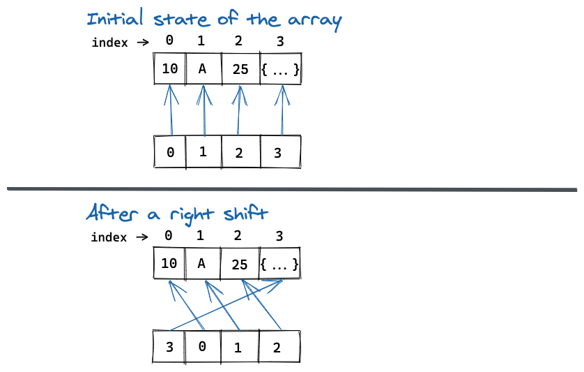

# Array Rotation With Pointer
This is a POC of rotating an array using another auxiliary array which stores the original array's indices.

For example,
```python
original_array = [1, True, 3.14, 'test']  # array items, initial state
indices_array = [0, 1, 2, 3]  # indices of the items when they were at initial state
```

The idea is that, when we rotate the array, we do not do modification in `original_array`, instead we will modify the indices in `indices_array`.

For example,
After a right shift
```python
original_array = [1, True, 3.14, 'test']
indices_array = [3, 0, 1, 2]
```

With the `CircularArray` class, we offer `list` like interface to run operations on array, such as `append`, `get`, slicing(`array[1]`), `clone`.
Two additional methods are available:
* `rotate_left_once`
* `rotate_right_once`

### Diagram

